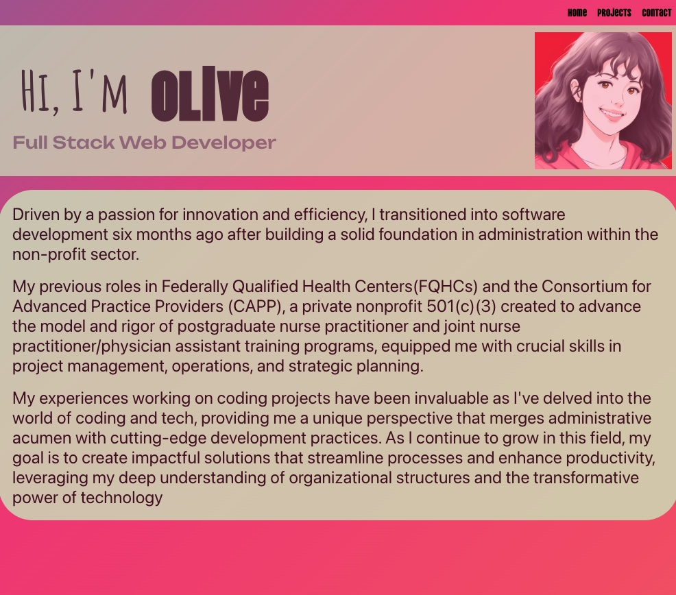
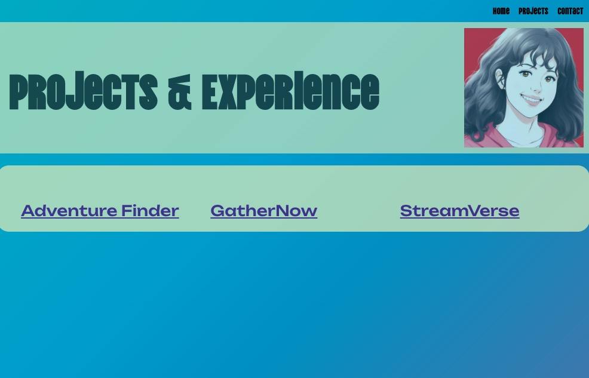

# React-Portfolio

This portfolio was created using React and deployed using Heroku. I used the React.js, node.js, and express.js frameworks. My react portfolio includes a summary description of my professional experiences, including my work prior to becoming a softward developer. My portfolio also includes a contact page which displays my email, linkedIn profile page, and GitHub profile page, as well as a page to display my coding projects. 

## Deployed portfolio

Open [https://my-dev-portfolio.herokuapp.com/](https://my-dev-portfolio.herokuapp.com/) to view it in your browser.

## Credits:
Huge thank you to my tutor Anthony Parrino for all the support and guidance. 

## Screenshots:

